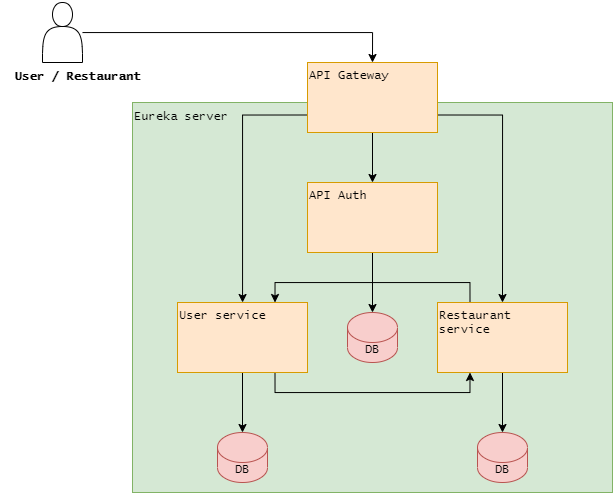
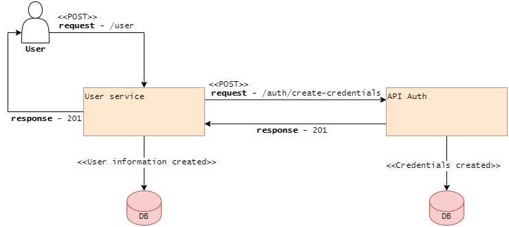
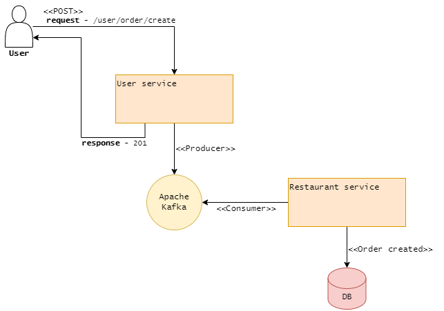

# e-eat

Application built with a microservices architecture for a food delivery through several restaurants.

## System parts

- api-auth: Responsible for authenticating and creating user credentials;
- api-gateway: Responsible for forwarding requests to services and validate the authentication token;
- eureka-server: Responsible for performing load balancing and registering services for communication;
- restaurant-service: Responsible for restaurant services;
- user-service: Responsible for user services.

# Technologies

- [Spring Framework](https://spring.io/);
- [Spring Cloud](https://spring.io/projects/spring-cloud);
- [PostgreSQL](https://www.postgresql.org/);
- [Apache Kafka](https://kafka.apache.org/);

## Diagrams

Below are some of the principal system diagrams.

### Overall system diagram:

### User creation diagram:

### Order diagram:

## Developed by:

[Gustavo Pereira da Fonseca](https://www.linkedin.com/in/gustavo-pereira053/)
